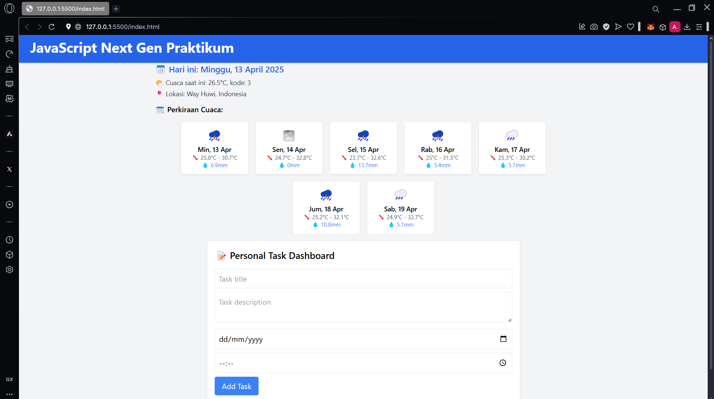
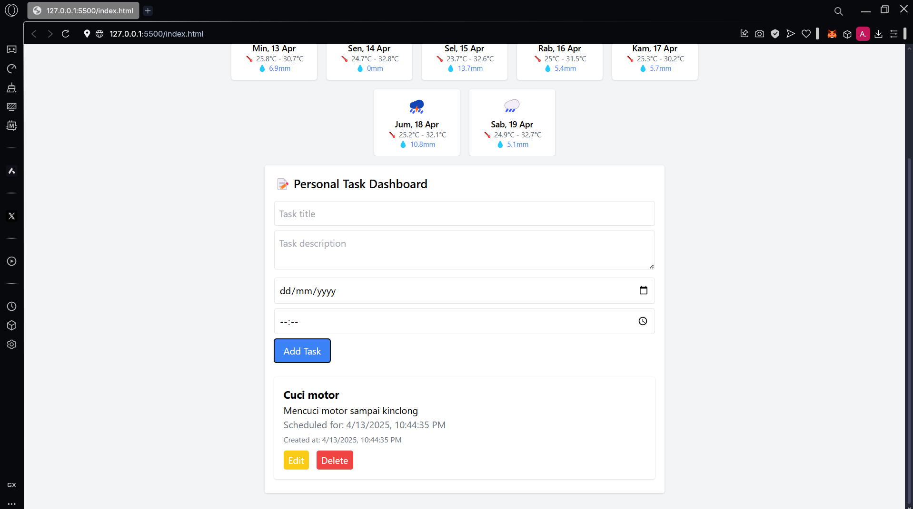

# Personal Dashboard App

Aplikasi dashboard personal berbasis web yang membantu kamu mengatur tugas-tugas harian sekaligus melihat cuaca real-time berdasarkan lokasi kamu. Cocok buat kamu yang butuh produktif sekaligus up-to-date dengan kondisi cuaca!

---

## Fitur 

- **Manajemen Tugas (To-Do List)**
  - Tambah, edit, dan hapus tugas
  - Data disimpan secara **permanen** di browser melalui `localStorage`
- **Informasi Cuaca Terkini & Prakiraan**
  - Cuaca berdasarkan lokasi pengguna (menggunakan Geolocation API)
  - Prakiraan cuaca harian lengkap dengan ikon kondisi
- **Kalender**
  - Menampilkan tanggal hari ini dalam format lokal Bahasa Indonesia
- **Antarmuka Dinamis & Responsif**
  - Dibuat dengan **Tailwind CSS**
  - UI ringan, minimalis, dan responsif

---

## 🛠️ Teknologi & Fitur ES6+ yang Diimplementasikan

- ✅ `const` & `let` untuk manajemen variabel yang lebih aman
- ✅ `Arrow functions` untuk sintaks lebih ringkas
- ✅ `Class` & `Constructor` (OOP modern)
- ✅ `Template literals` untuk menyisipkan HTML dinamis
- ✅ `Destructuring` & `Spread Operator`
- ✅ `async/await` untuk fetching API yang bersih dan mudah dibaca
- ✅ **Modular JS**: menggunakan `import` dan `export`
- ✅ Pemakaian `localStorage` sebagai persistent storage
- ✅ `Date` & `Intl` untuk formatting waktu

## 📸 Screenshot

---
