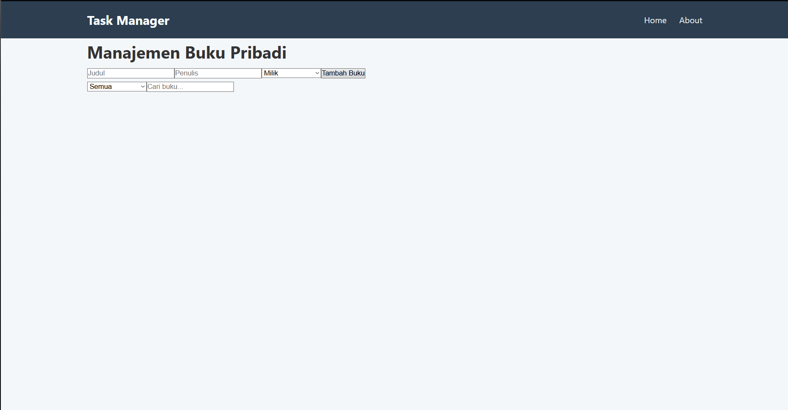
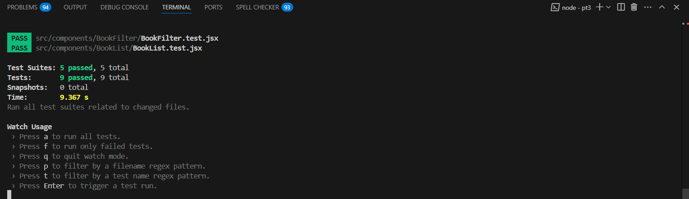

# 📚 Aplikasi Manajemen Buku Pribadi

Aplikasi React untuk mencatat dan mengelola buku pribadi pengguna — buku yang dimiliki, sedang dibaca, atau ingin dibeli. Aplikasi ini dirancang dengan komponen modular, navigasi multi-halaman, dan penyimpanan lokal menggunakan `localStorage`.

---

## 🧩 Fitur React yang Digunakan

| Fitur | Deskripsi |
|-------|-----------|
| `useState`, `useEffect` | Mengelola data lokal dan efek samping |
| Context API | Manajemen state global dengan reducer |
| Custom Hooks | `useLocalStorage` untuk persist data, `useBookStats` untuk statistik |
| Routing | `react-router-dom` untuk navigasi antar halaman |
| PropTypes | Type checking props di komponen |
| Unit Testing | Menggunakan Jest + React Testing Library untuk pengujian |
## 🖼️ Screenshot Antarmuka

### Halaman Utama

---
### Halaman About

---
## 💬 Komentar dalam Kode

Contoh pada `BookContext.js`:
```jsx
// Reducer function untuk memproses action dan update state buku
const bookReducer = (state, action) => {
  switch (action.type) {
    case 'ADD_BOOK':
      return [...state, action.payload]; // Tambah buku baru
    case 'UPDATE_BOOK':
      return state.map(book => book.id === action.payload.id ? action.payload : book);
    case 'DELETE_BOOK':
      return state.filter(book => book.id !== action.payload);
    default:
      return state;
  }
};
```

Contoh pada `BookForm.jsx`:
```jsx
// Submit form buku: validasi input, buat objek buku, panggil onSubmit dari parent
const handleSubmit = (e) => {
  e.preventDefault();
  if (!title.trim() || !author.trim()) return;

  const book = {
    id: existingBook ? existingBook.id : Date.now(),
    title,
    author,
    status,
  };

  onSubmit(book);
  resetForm();
};
```

---

## ✅ Laporan Testing

> Semua komponen utama telah diuji:

| Komponen | Status |
|----------|--------|
| `BookForm` | ✅ Pass |
| `BookList` | ✅ Pass |
| `BookFilter` | ✅ Pass |
| `useBookStats` | ✅ Pass |
| `BookContext` | ✅ Pass |

### Screenshot Hasil Test


---

## 🧠 Kesimpulan

Aplikasi ini memenuhi seluruh syarat praktikum:
- Fungsi CRUD buku
- Filter & pencarian
- State management dengan Context API
- Unit test komprehensif
- Struktur folder rapi dan modular